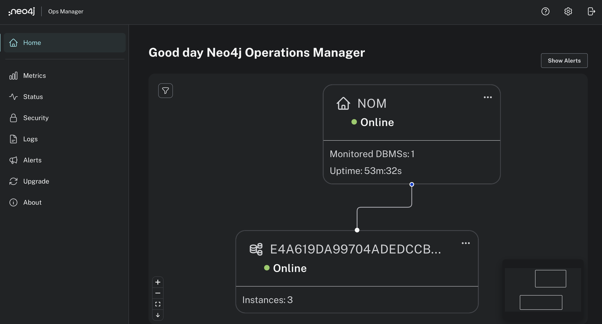
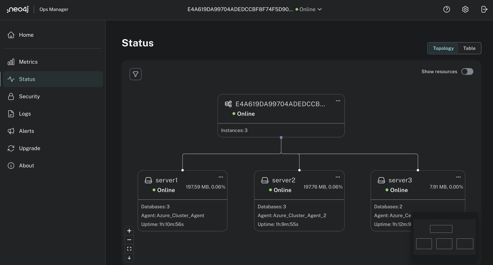
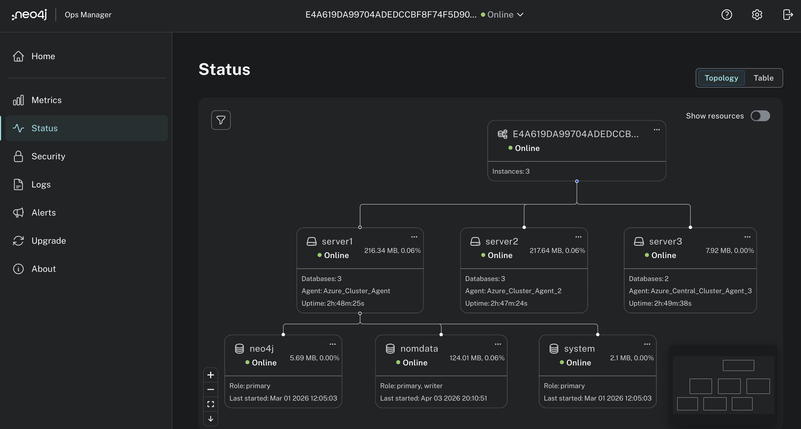
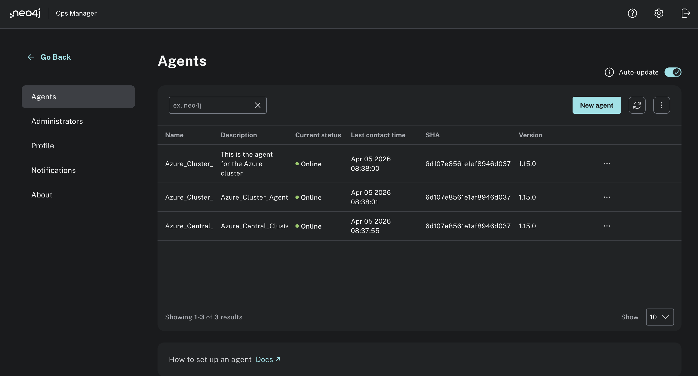
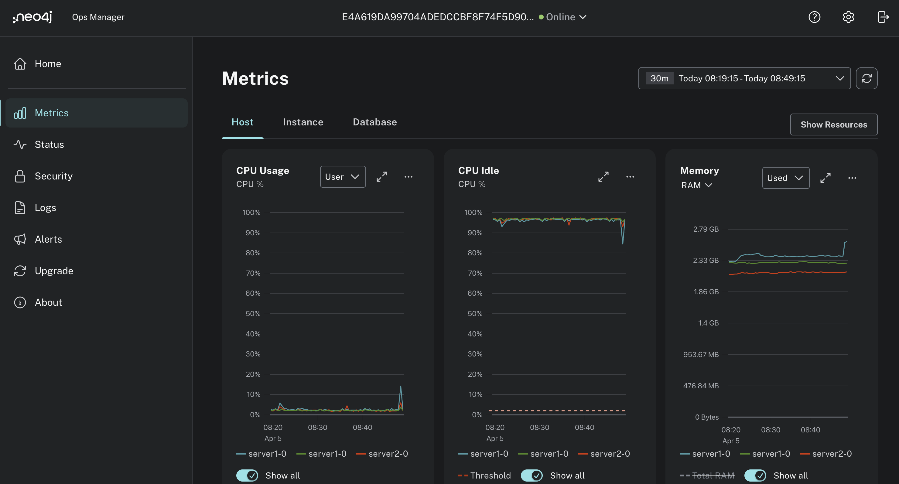

# Neo4j on AKS: Production Runbooks

Step-by-step runbooks for deploying and operating **Neo4j Enterprise** clusters
and **Neo4j Ops Manager (NOM)** on **Azure Kubernetes Service (AKS)**.

These guides are built from real production deployments. They cover not just
the happy path, but the edge cases, gotchas, and operational decisions that
matter when running Neo4j at scale in the cloud.

---

## What You Get

A fully operational Neo4j cluster monitored and managed through Neo4j Ops Manager,
running on AKS with production-grade TLS, persistent storage, and Azure Load Balancers.

### NOM Dashboard

The NOM home screen gives an at-a-glance view of all monitored DBMS instances
and their health status.

### 3-Node Cluster Topology

Once all agents are connected, NOM visualises the full cluster topology. All
three nodes are visible with their online status, database counts, agent names,
and uptime.

### Database View

NOM expands the view to show the databases running on each node, including their
roles (primary or writer) and when they were last started. This is useful for
verifying database topology and identifying which node holds the write leader for
each database.

### Agent Status

The Agents page confirms all NOM agents are connected and reporting. In a
multi-cluster setup, agents from different AKS clusters all appear here.

### Metrics

NOM collects host-level and database-level metrics across all nodes. CPU usage,
CPU idle, and memory are tracked per node and displayed as time-series graphs.

---

## Runbooks

| Runbook | Description |
|---------|-------------|
| [Neo4j Cluster Install](Neo4j_Cluster_Install.md) | Deploy a multi-node Neo4j Enterprise cluster on AKS with TLS, persistent storage, and Azure Load Balancer |
| [NOM Server Install](NOM_Server_Install.md) | Deploy Neo4j Ops Manager server with HTTPS + gRPC services, Let's Encrypt TLS, and a dedicated backing database |
| [NOM Agent Install](NOM_Agent_Install.md) | Deploy the NOM monitoring agent as a sidecar inside each Neo4j pod, including multi-cluster setups |

---

## Why These Runbooks

**Production-hardened.** Each guide covers real failure modes encountered in
production: stale routing tables, Raft leader election behaviour, TLS cert
mismatches, Helm timing issues, and more. You won't find these details in the
standard product docs.

**Multi-cluster aware.** The NOM agent runbook explicitly handles the common
case where your NOM server and monitored Neo4j clusters run on different AKS
clusters. It covers secret placement, cross-cluster DNS resolution, and TLS
trust across cluster boundaries.

**Security-first.** Passwords and secrets are always stored as Kubernetes
secrets, never hardcoded in Helm values files. The guides explain *why*, not
just *what*, so your team understands the reasoning behind each decision.

**Azure-native.** Built specifically for AKS. Covers Azure StorageClass
configuration, Azure Internal Load Balancer annotations, AKS credential
management with `az aks get-credentials`, and Azure DNS record setup for
multi-service NOM deployments.

**Upgrade and renewal paths included.** Every runbook ends with maintenance
procedures: rolling Neo4j version upgrades, TLS certificate renewal (90-day
Let's Encrypt cycle), and NOM upgrades. The runbooks stay useful well beyond
the initial install.

**Fully parameterised.** All environment-specific values use `<PLACEHOLDER>`
syntax with inline comments and a Reference Values table at the end of each
guide. Adapt to your environment without hunting through the document.

---

## Who This Is For

- **Platform / infrastructure engineers** standing up Neo4j on AKS for the
  first time or migrating from VMs
- **Neo4j field engineers and partners** working with customers on AKS deployments
- **Architects** evaluating Neo4j's operational model on Kubernetes before
  committing to a production topology

---

## Prerequisites

- Azure subscription with AKS cluster(s) provisioned
- `az`, `kubectl`, `helm`, `openssl` installed locally
- Neo4j Enterprise license
- A wildcard or multi-SAN TLS certificate for your domain

---

## Versioning

| Component | Version |
|-----------|---------|
| Neo4j | 2026.x Enterprise |
| Neo4j Ops Manager | 1.15.x |
| Platform | Azure Kubernetes Service |

---

## Contributing

Issues and pull requests are welcome. If you hit a scenario not covered here,
such as an error, a configuration edge case, or a step that needed clarification,
please open an issue or submit a PR.
